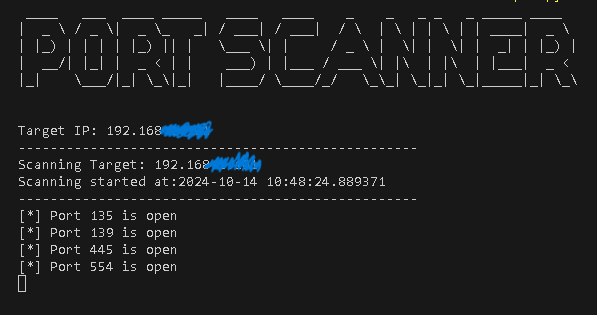
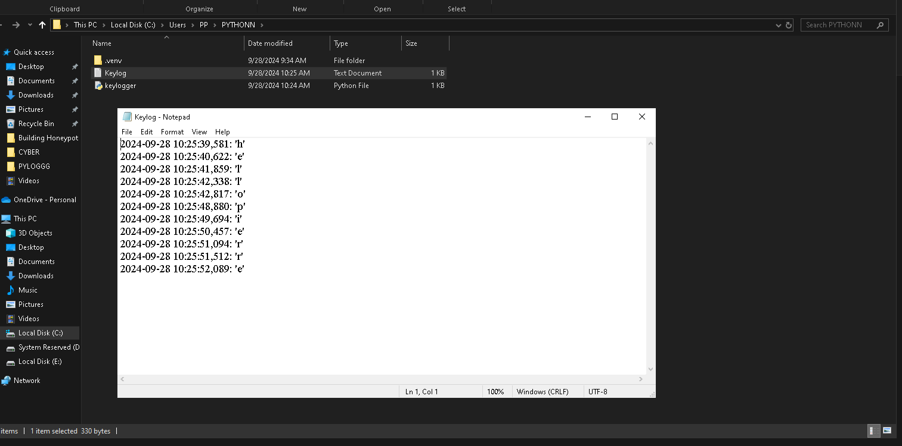

# Active Directory Lab

I produced an Active Directory environment, successfully creating 2 new users, joined a computer to a new domain, and logged in as a domain user! Includes: Splunk, Windows Server 2022, Windows 10, Kali Linux

# Coding a Port Scanner using PYTHON

I used Python to create a Port Scanner!

[SEE HOW I DID IT:](Python Port Scanner.pdf)

# Creating a Python Keylogger

I used Python to create a REAL Keylogger on my personal computer!

[HERE'S HOW:](Python Keylogger.pdf)

# Building a Network

Here I have created a simple network using Cisco's Packet Tracer software.

[Here's how I did it:](My Network.pdf)

# Building a SIEM

I configured a home lab using Elastic SIEM and a Kali Linux Virtual Machine.

[This was the process:](Home SIEM Lab.pdf)

## To be continued...
