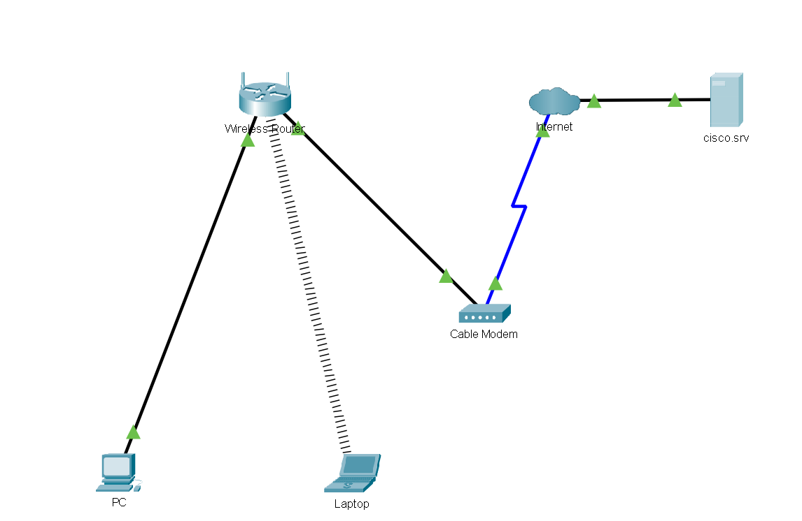
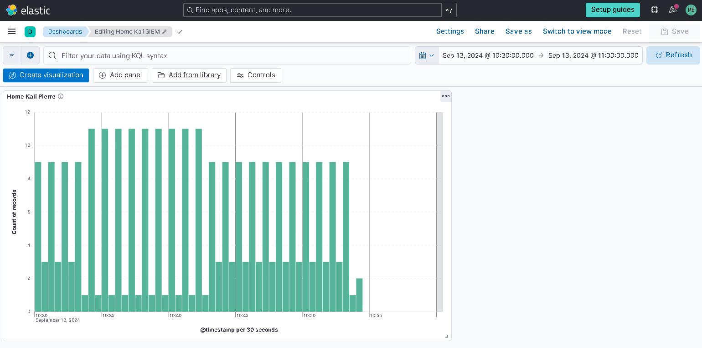

# Building a Network

Here I have created a simple network using Cisco's Packet Tracer software.

[Here's how I did it:](My Network.pdf)

# Building a SIEM

I configured a home lab using Elastic SIEM and a Kali Linux Virtual Machine.

[This was the process:](Home SIEM Lab.pdf)

## To be continued...
